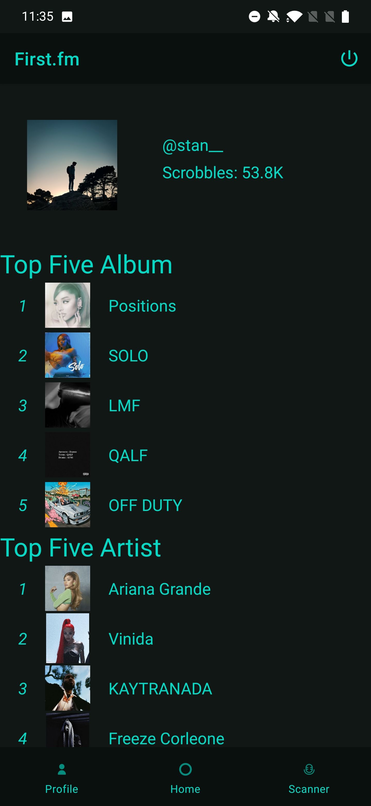
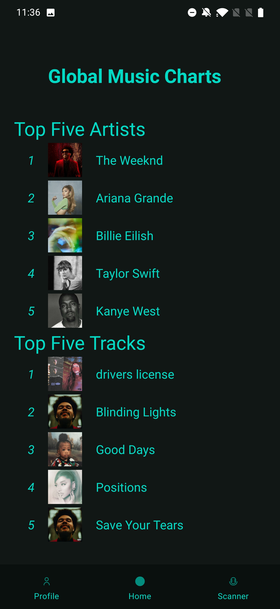
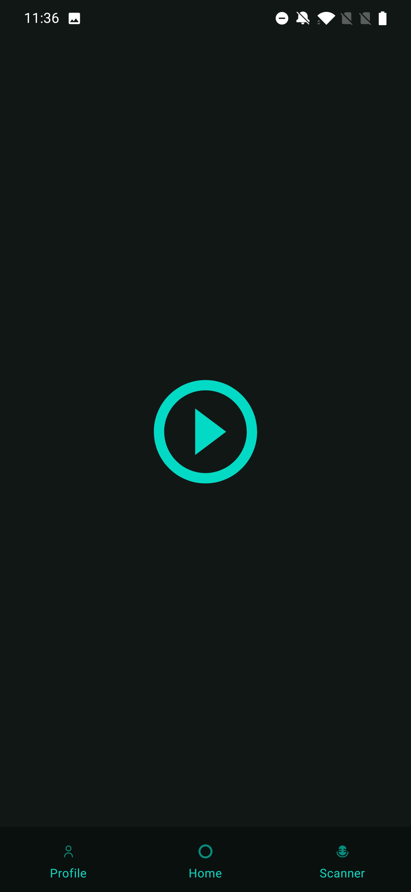
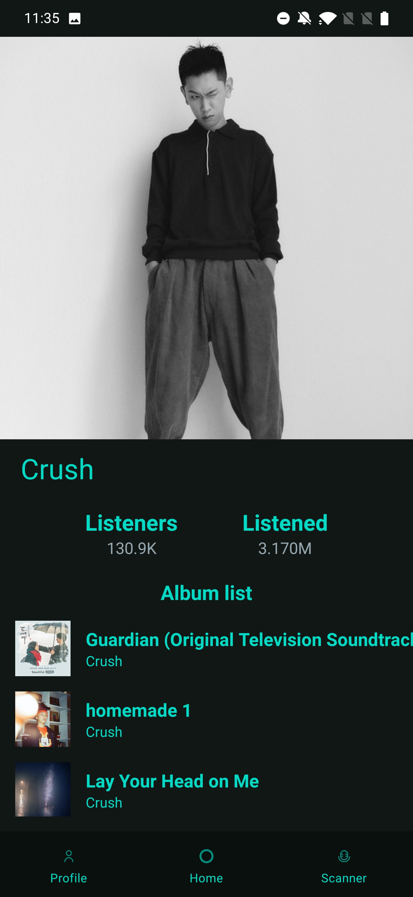
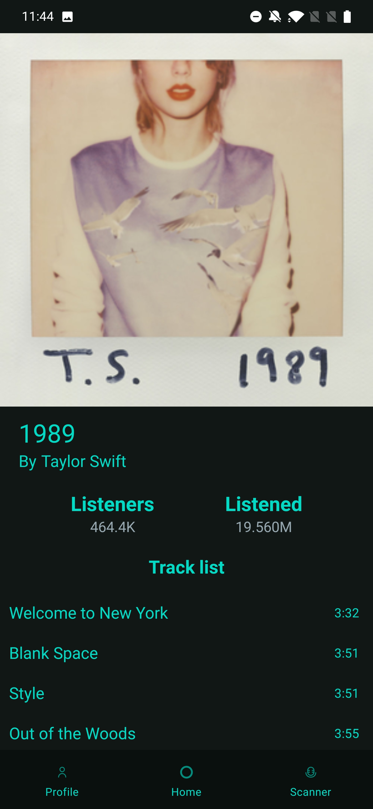
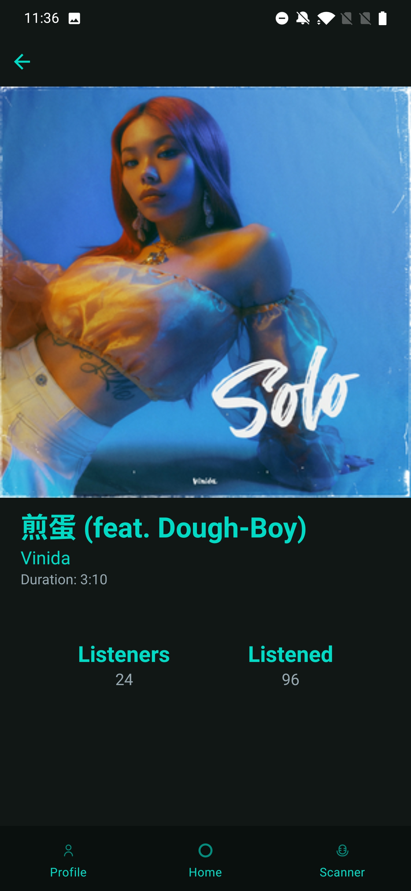

# First.fm

[Last.fm](https://www.last.fm/home) client for Android, written in Kotlin, made as a part of a school project.

## Features

- View your profile with your top tracks/albums/artists
- View track/artist/album details
- View global worldwide charts on Last.fm
- Scan a song to identify it (Shazam-like)

### Screenshots

<p float="left">
    
    
    
</p>

<p float="left">
    
    
    
</p>

## Build

Get and add the needed API keys to `gradle.properties`:

```
AUDD_API_TOKEN=
LASTFM_API_TOKEN=
LASTFM_API_SECRET=
SPOTIFY_API_TOKEN=
```

AudD is for the Shazam-like music scanning and Spotify is to retrive artist and album images since [the Last.fm API stopped providing them](https://stackoverflow.com/q/55978243/6945353).
